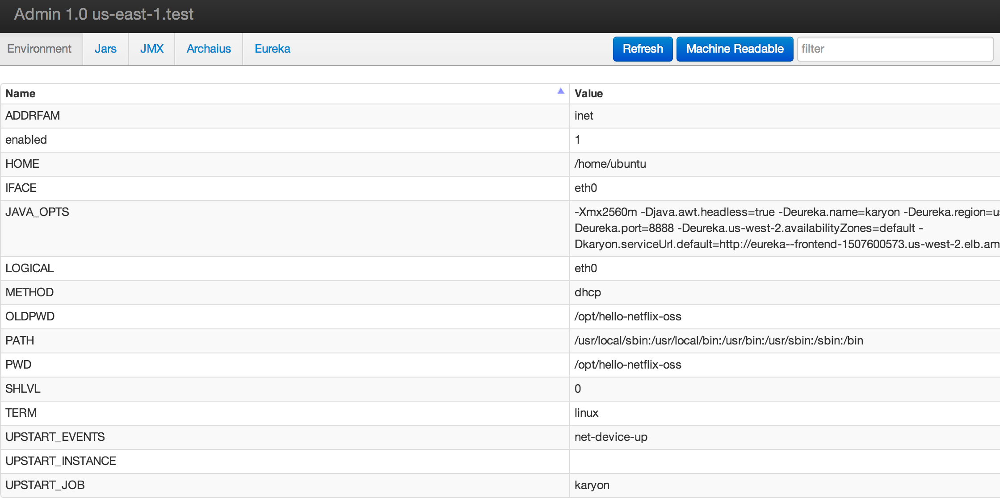
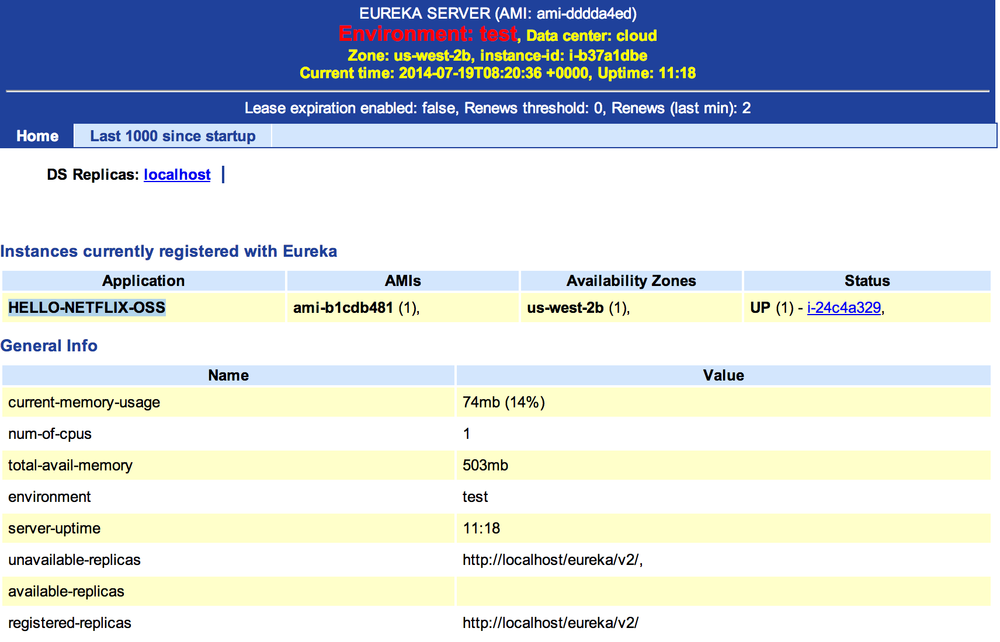

# [Karyon](https://github.com/Netflix/Karyon)

So far, we've brought up what we'd call infrastructure. This exercise starts to bring a real application and explore how it's deployed over time.

Karyon is a framework and library that essentially contains the blueprint of what it means to implement a cloud ready web service. 
All the other fine grained web services and applications that form our SOA graph can essentially be thought as being cloned from this basic blueprint.
It combines many of the library @netflixoss projects:

* Bootstrapping , dependency and Lifecycle Management (via Governator)
* Runtime Insights and Diagnostics (via karyon-admin-web module)
* Configuration Management (via Archaius)
* Service discovery (via karyon)
* Powerful transport module (via RxNetty)

## Build and Bake

Karyon would like to register with eureka, which exposes the problem of how do you discover the service discovery service? 
The <a href="https://github.com/Netflix/eureka/wiki/Configuring-Eureka-in-AWS-Cloud" target="_build">Eureka documentation</a> explains a few great ways to setup your Eureka to solve this problem.
For example, uses Elastic IPs (to give our instances static IPs) or DNS.
To keep this tutorial simple, we're going to just use the eureka ELB we configured earlier in [Step 15](tutorial/Eureka.md).
If you don't have the eureka--frontend ELB's DNS Name handy, go back to Asgard and find it.
Make sure to use that DNS name below instead of just copying like you have in previous steps.

    EUREKA_ELB=*ELB DNS NAME from Step 15*
    cd ~/zerotocloud
    KARYON_OPTS="-Dkaryon.serviceUrl.default=http://$EUREKA_ELB/v2/" ./gradlew :karyon:buildDeb
    sudo aminate -e ec2_aptitude_linux -b ubuntu-base-ami-ebs karyon/build/distributions/karyon_1.0.0_all.deb

## Deploy

Since Karyon is meant to be a middle-tier service, there's no need for a load balancer but it will still live in an ASG.

1. Naviate to Asgard. This can be done by finding the DNS Name from the end of [Step 13](AsgardStandalone.md) or finding the Asgard ELB and using the DNS Name.
2. Return to [Step 13](AsgardStandalone.md)
2. Follow "Create Application", using the name "karyon" instead of "asgard".
4. Follow "Create Auto Scaling Group" using the name "karyon" instead of "asgard". Leave the Load Balancer section blank. Also leave the IAM Profile section blank, since Karyon doesn't require any access to the AWS APIs.
5. Follow "View instance" to get the DNS Name the instance. You can try this in your browser, but it won't work because of the security group settings.

## Allow Access

We'd also like Karyon to register with Eureka, but the default security group setup prevents Karyon from talking to Eureka. This is something that Asgard can do, you'll see it below.

5. In Asgard, go to the _App | Security Groups_ Page.
6. Select the "eureka" security group. 
7. Click "Edit Securty Group"
8. Click the "Open" checkbox next to karyon. Leave the port as 7001.
9. Click "Update Security Group"
 
The first problem you'll realize is that you have no way to query the Karyon instance, since there is no longer an ELB exposed to the world for you to access.
The simple answer is to modify its Security Group and add access to the whole world (or just yourself). 
We then quickly learn that Asgard no functionality to support this. 
It's ability to edit Security Groups is limited to allowing other Security Access, not arbitrary rules.
For that we'll have to to the AWS Console. Karyon will open two ports, one for its API and one for Administrative access.

10. Go the <a href="https://console.aws.amazon.com/ec2/v2/home?region=us-west-2#SecurityGroups:" target="_blank">Security Group section</a> of the AWS Console.
11. Select the "karyon" Security Group (created by Asgard).
12. Select the "Incoming" tab in the bottom section.
13. Click "Edit"
14. In the dialog that comes up, click "Add Rule". Select "Custom TCP Rule". Set the port to 8888. Set source to Anywhere.
15. Click "Add Rule" button again. Select "Custom TCP Rule". Set the port to 8077. Set source to Anywhere.
16. Click "Save" to close the dialog. It is very likely that the UI won't update.
17. Browse to the _http://*Instance DNS Name*:8888/hello_ URL. Since this is a template application, there is no rich API to query. 
18. Browse to the _http://*Instance DNS Name*:8077/admin_ URL. This page is visual, explore it. You'll find the ability to change JMX settings, view Archaius properties, Eureka caches. 
19. Confirm instance is in Eureka, by browsing to the Eureka ELB address. We dpeloyed it as karyon in Asgard and with HELLO-NETFLIX-OOS in Eureka. This discrepancy will cause Asgard to not be able to show Eureka status. 

## Red/Black Deploy of Karyon

If we had to follow all the previous steps just to deploy a new version, we'd never get anything done. 
The day-to-day operations of Netflix engineers is focused on pushing code out via process known as Red/Black deploy.
The principle is that we bring up a new ASG with the new code, disabling traffic to the old ASG.
Once we're satified with the new code and some time has passed we can delete the old ASG.
If there's been a regression, we re-enable traffic to the old ASG and delete the new ASG.
Asgard is specifically tuned to this workflow and makes it very easy.

First, start by building and baking with a small change with done by the _patchEndpoint_ task:

    EUREKA_ELB=*ELB DNS NAME from Step 15*
    cd ~/zerotocloud
    KARYON_OPTS="-Dkaryon.serviceUrl.default=http://$EUREKA_ELB/v2/" ./gradlew clean :karyon:patchEndpoint :karyon:buildDeb
    sudo aminate -e ec2_aptitude_linux -b ubuntu-base-ami-ebs karyon/build/distributions/karyon_1.0.0_all.deb

Then perform a Red/Black Deployment:

1. From Asgard, go to _Cluster | Clusters_.
2. Find the Karyon cluster, and select it. The path should look like _/us-west-2/cluster/show/karyon_.
3. There should be a "Create Next Group" box on the right. This is where the next ASG is staged.
3. Select AMI Image Id, select most recently built.
4. Click "Create Next Group karyon-v000". A task page will come up to show the progress of calls to Amazon. Asgard will also wait for instances to come up.
5. Return to the Karyon Cluster page, there is a link at the top and bottom of the page.
6. Click the "Disable" button in the first ASG. For ASGs behind a load balancer, Asgard will stop replacement of instances and remove the existing instances from the load balancer. When Eureka is integrated, Asgard will unregister the instances from Eureka.
7. Expand the "Count" plus sign to see the instance in the new ASG.
8. Click the instance's link to find the DNS Name for the instance.
9. Browse to the _http://*Instance DNS Name*:8888/hello_. You should see a new message.
10. If satified by the new message, go back to the cluster screen and click "Delete" on the first ASG.